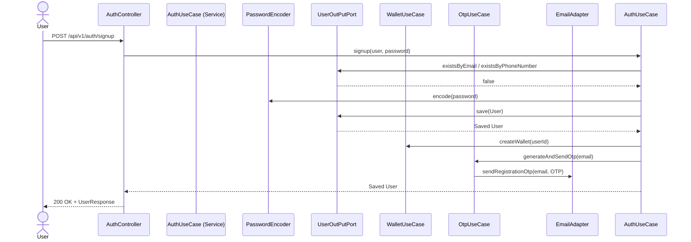
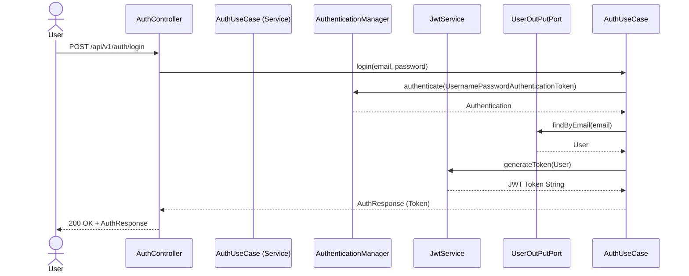
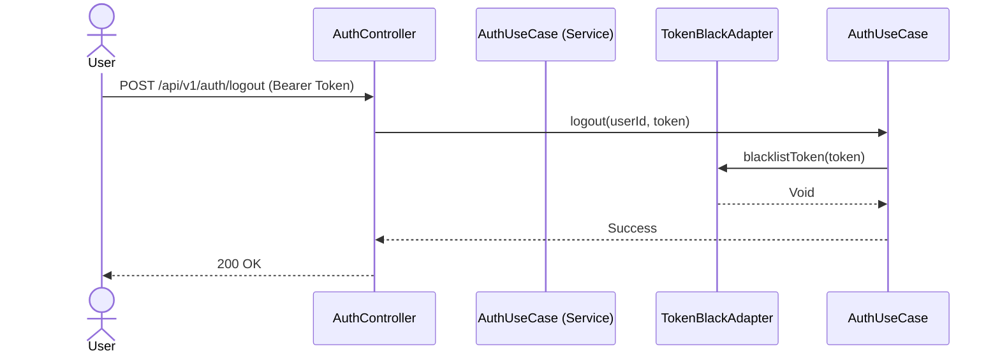
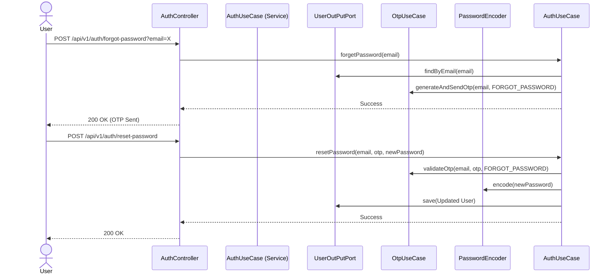
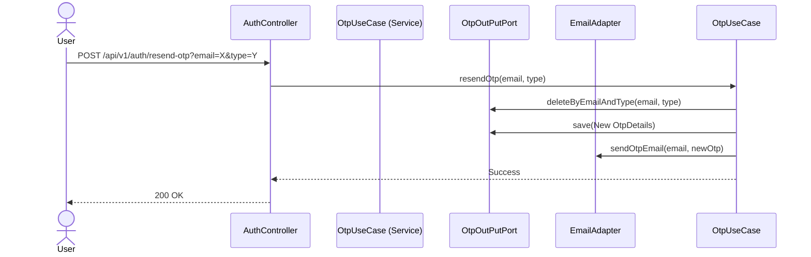

# Auth Service Design

This document details the request flows for the Authentication Use Cases.

## User Registration Flow

## User Login Flow

## User Logout Flow

## Password Recovery Flow

## Resend OTP Flow

