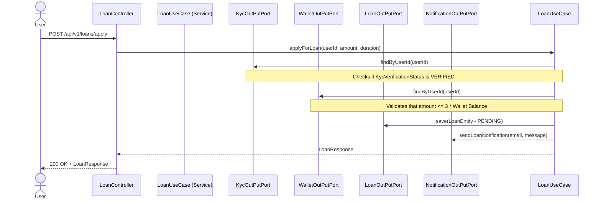
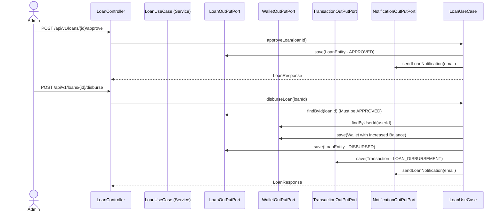
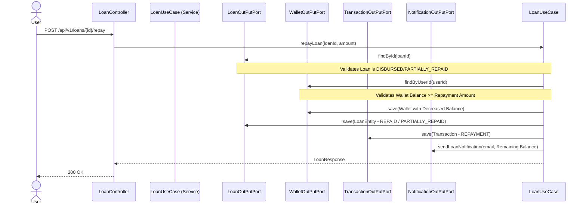
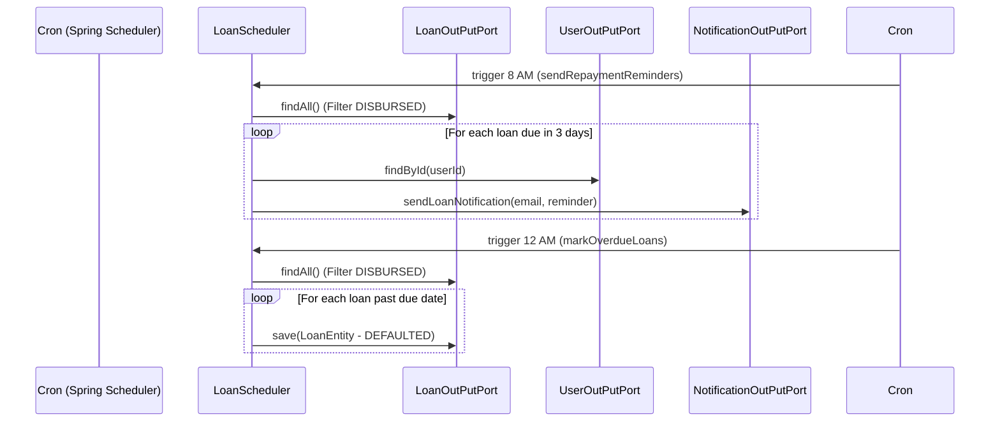
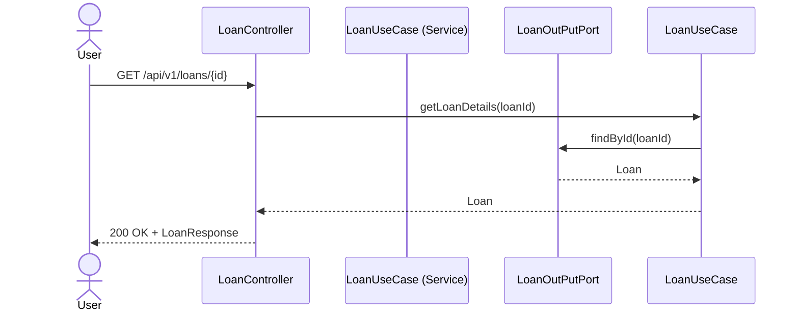
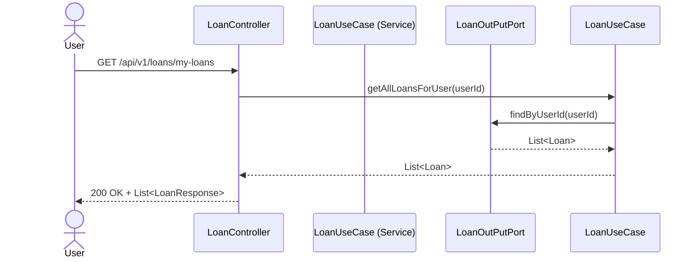
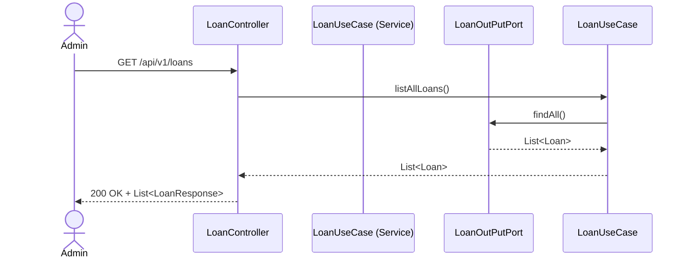

# Loan Service Design

This document details the request flows for Loan operations, from Application to Disbursement, Repayment, and Scheduled jobs.

## Loan Application

## Loan Approval & Disbursement

## Loan Repayment

## Scheduled Jobs (Loan Reminders & Overdue Marking)

## Get Loan Details

## Get My Loans

## List All Loans (Admin)

