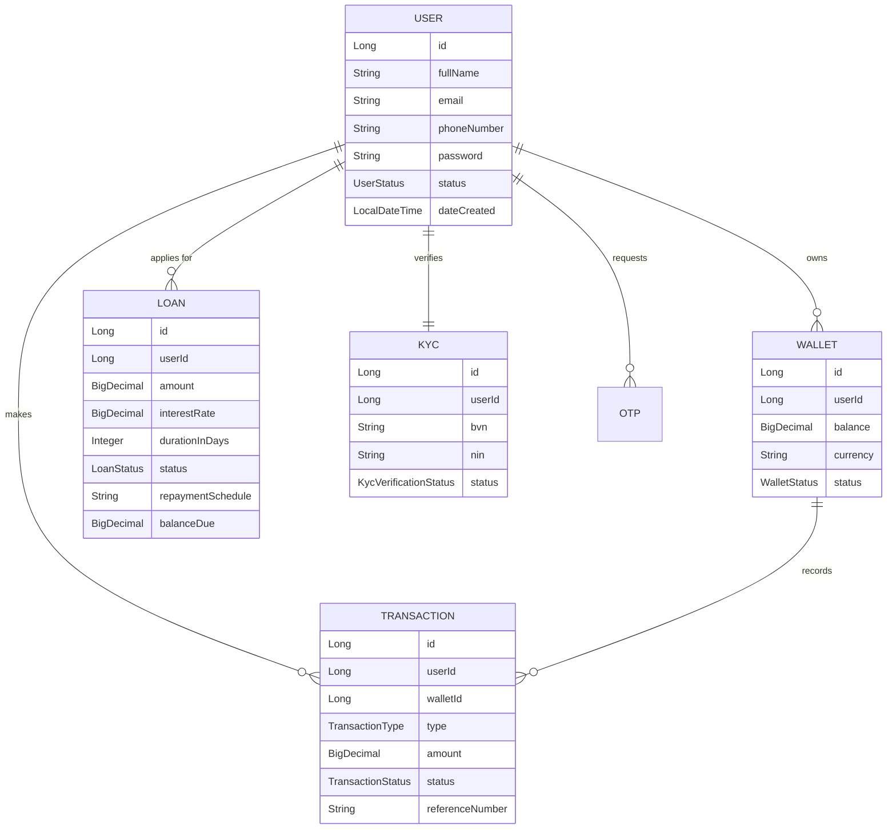

# System Architecture Overview

This project is built using a strict **Hexagonal Architecture** (also known as Ports and Adapters). This ensures that the core domain logic is completely decoupled from framework dependencies, databases, and external APIs.

## Hexagonal Flow

```mermaid
graph TD
    %% Input Layer
    subgraph Primary Adapters [Input Adapters / Controllers]
        RC[REST Controllers]
        WH[Webhook Listeners]
        SJ[Scheduled Jobs]
    end

    %% Ports
    subgraph Primary Ports [Input Ports / Use Cases]
        Usecase[Application UseCases Interfaces]
    end

    %% Core Domain
    subgraph Core Domain [Domain Services & Models]
        DS[Domain Services]
        Models[Domain Models / Entities]
    end

    %% Ports
    subgraph Secondary Ports [Output Ports]
        OutPort[Output Port Interfaces]
    end

    %% Output Layer
    subgraph Secondary Adapters [Output Adapters / Infrastructure]
        JPA[Persistence Adapters - JPA]
        KAFKA[Messaging Adapters - Kafka]
        PAY[External API Adapters - Paystack]
        MAIL[Email Adapters]
    end

    %% Flow
    Primary Adapters -->|Implements API| Primary Ports
    Primary Ports -->|Delegates to| Core Domain
    Core Domain -->|Defines Logic| Models
    Core Domain -->|Uses| Secondary Ports
    Secondary Adapters -.->|Implements| Secondary Ports
```

## Entity Relationship Diagram


