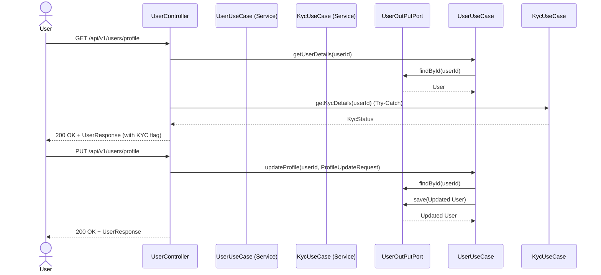
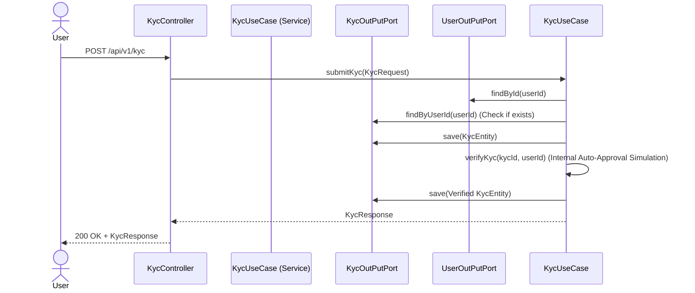
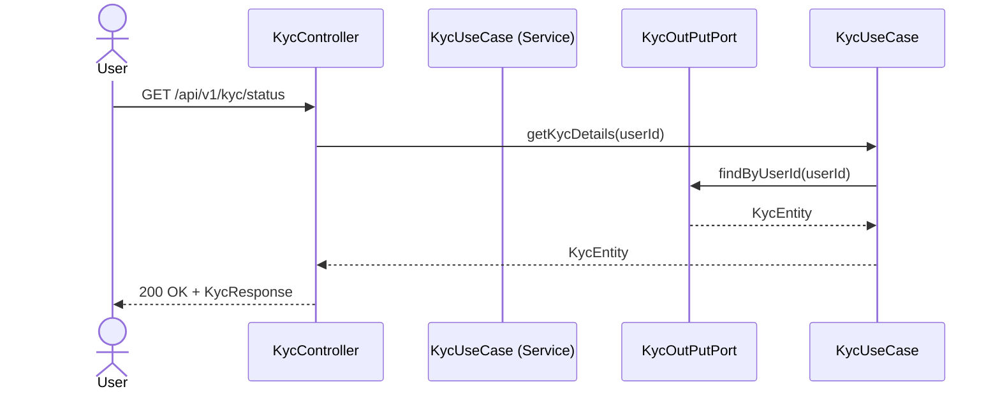

# User & KYC Service Design

This document details the request flows for User Profile management and KYC Verification.

## Get & Update Profile

```mermaid
sequenceDiagram
    actor User
    participant UserController
    participant UserUseCase (Service)
    participant KycUseCase (Service)
    participant UserOutPutPort

    %% Get Profile
    User->>UserController: GET /api/v1/users/profile
    UserController->>UserUseCase: getUserDetails(userId)
    UserUseCase->>UserOutPutPort: findById(userId)
    UserOutPutPort-->>UserUseCase: User
    UserController->>KycUseCase: getKycDetails(userId) (Try-Catch)
    KycUseCase-->>UserController: KycStatus
    UserController-->>User: 200 OK + UserResponse (with KYC flag)

    %% Update Profile
    User->>UserController: PUT /api/v1/users/profile
    UserController->>UserUseCase: updateProfile(userId, ProfileUpdateRequest)
    UserUseCase->>UserOutPutPort: findById(userId)
    UserUseCase->>UserOutPutPort: save(Updated User)
    UserOutPutPort-->>UserUseCase: Updated User
    UserController-->>User: 200 OK + UserResponse
```

## Submit KYC Details

```mermaid
sequenceDiagram
    actor User
    participant KycController
    participant KycUseCase (Service)
    participant KycOutPutPort
    participant UserOutPutPort

    User->>KycController: POST /api/v1/kyc
    KycController->>KycUseCase: submitKyc(KycRequest)
    KycUseCase->>UserOutPutPort: findById(userId)
    KycUseCase->>KycOutPutPort: findByUserId(userId) (Check if exists)
    KycUseCase->>KycOutPutPort: save(KycEntity)
    KycUseCase->>KycUseCase: verifyKyc(kycId, userId) (Internal Auto-Approval Simulation)
    KycUseCase->>KycOutPutPort: save(Verified KycEntity)
    KycUseCase-->>KycController: KycResponse
    KycController-->>User: 200 OK + KycResponse
```

## Get KYC Status

```mermaid
sequenceDiagram
    actor User
    participant KycController
    participant KycUseCase (Service)
    participant KycOutPutPort

    User->>KycController: GET /api/v1/kyc/status
    KycController->>KycUseCase: getKycDetails(userId)
    KycUseCase->>KycOutPutPort: findByUserId(userId)
    KycOutPutPort-->>KycUseCase: KycEntity
    KycUseCase-->>KycController: KycEntity
    KycController-->>User: 200 OK + KycResponse
```
