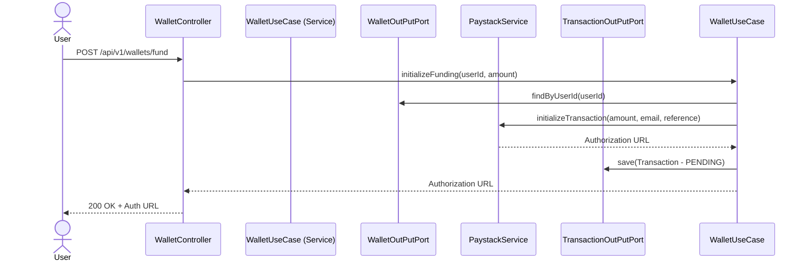
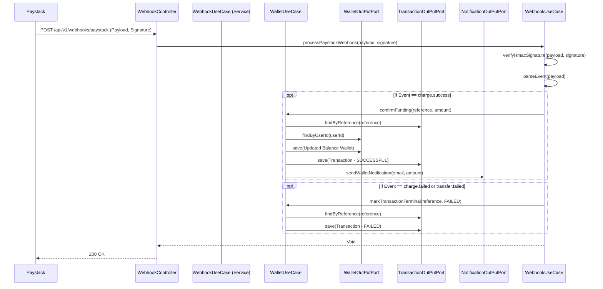
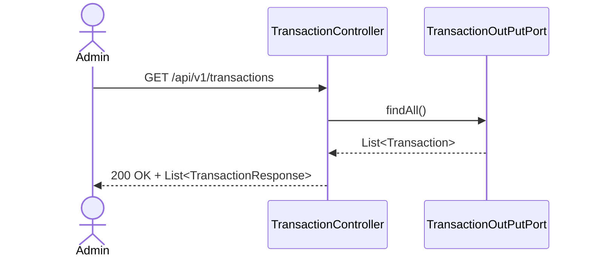
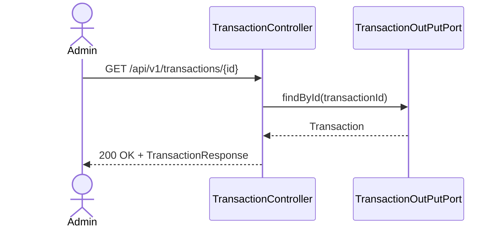
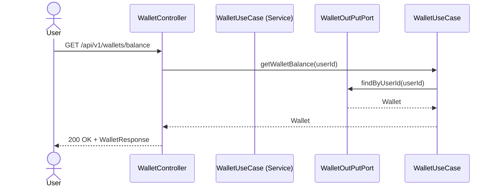
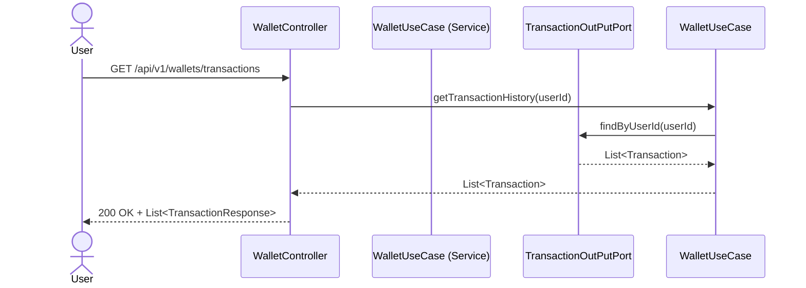

# Wallet & Transaction Service Design

This document details the request flows for Wallet operations and Transactions.

## Wallet Funding Initialization

## Paystack Webhook Processing (Funding Confirmation)

## Fetching Transactions (All)

## Fetching Single Transaction

## Get Wallet Balance

## Get User Transaction History

